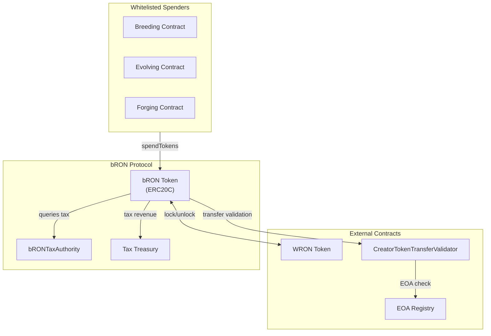
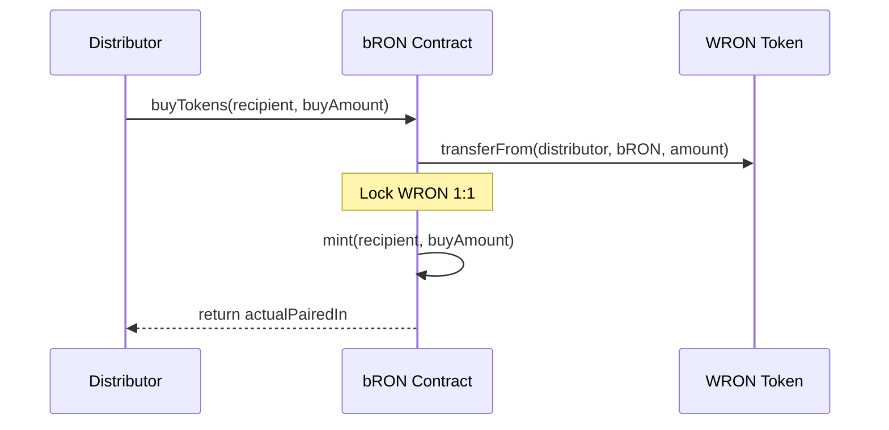
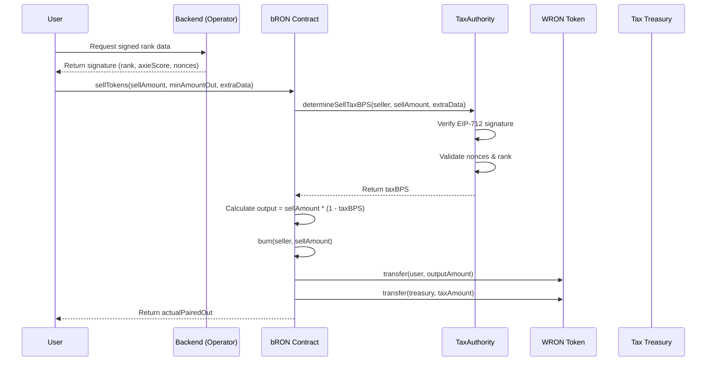
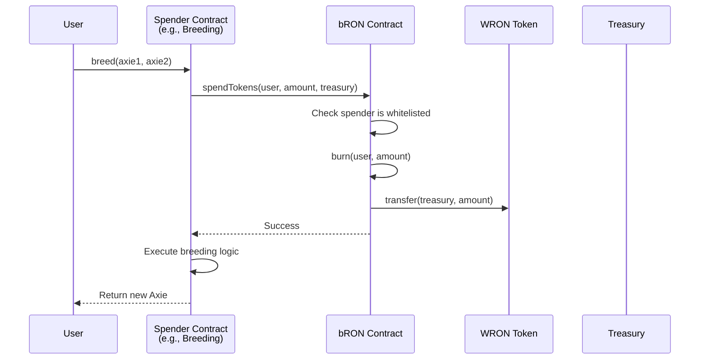

# bRON (Bonded RON)

**Version:** 1.0  
**Status:** Draft  
**Last Updated:** January 2026

## Abstract

bRON (Bonded RON) is an AppToken - a programmable ERC20-C token that wraps WRON with built-in usage constraints. It can be spent like regular RON, but with restrictions designed to encourage contribution while reducing sell pressure.

**Thesis:** By issuing a programmable version of RON with built-in usage constraints, we can distribute more rewards without increasing sell pressure—incentivizing spending and activity in a sustainable way that drives more treasury revenue and long-term ecosystem growth.

## Table of Contents

- [1. Overview](#1-overview)
- [2. System Architecture](#2-system-architecture)
- [3. Core Components](#3-core-components)
- [4. Security Considerations](#4-security-considerations)
- [5. Technical Specifications](#5-technical-specifications)

## 1. Overview

### 1.1 What is an AppToken

AppTokens are programmable ERC20 tokens (ERC20-C) that let developers control how tokens are transferred, spent, or traded—enabling more sustainable, targeted incentives within apps and games. Learn more at apptokens.com.

### 1.2 Core Mechanics

| Capability | Description |
|------------|-------------|
| Spendable | On all Axie Core features (breeding, evolving, ascending, forging, etc.) |
| Sellable | With dynamic tax tied to Axie Score - discourages extraction, encourages spending |
| Non-Transferable | Soulbound - cannot be transferred between wallets |

### 1.3 Token Rules

| Rule | Description |
|------|-------------|
| Transferability | bRON is soulbound and NOT transferable |
| Conversion | Can only be unwrapped into WRON (with tax). Cannot be sold in LP |
| Minting | Cannot swap WRON into bRON. bRON is earned through ecosystem activities |
| Backing | For every 1 bRON minted, 1 WRON is locked (prevents over-minting) |

### 1.4 Tax Tiers (Axie Score)

Higher Axie Score = lower tax. Tax is applied when swapping bRON to WRON.

| Axie Score Title | Tax Rate |
|------------------|----------|
| Mythkeeper | 5% |
| Atia's Guardian | 15% |
| Chosen of Atia | 30% |
| Atia Seeker | 50% |
| Lunacian Pioneer | 70% |
| Lunacian (default) | 80% |

## 2. System Architecture



### 2.1 Contract Overview

The bRON protocol consists of the following contracts:

| Contract | Purpose |
|----------|---------|
| bRON | Core ERC20C token with buy/sell/spend functionality |
| bRONTaxAuthority | Determines sell tax rates based on user rankings |
| CreatorTokenTransferValidator | Enforces transfer restrictions on bRON (ERC20C) |
| EOARegistry | Registry of externally owned accounts for transfer validation |

### 2.2 Contract Dependencies

- bRON queries bRONTaxAuthority for sell tax calculation
- bRON uses CreatorTokenTransferValidator for transfer security enforcement
- bRONSpenderUpgradeable enables external protocols to spend bRON
- CreatorTokenTransferValidator uses EOARegistry for EOA verification

## 3. Core Components

### 3.1 bRON Token Contract

The main ERC20C token contract implementing bonded RON functionality. It wraps WRON 1:1 and coordinates minting, burning, and spending, while enforcing buy/sell fees and integration with the Tax Authority.

**Inheritance:**
- ERC20C (Creator Token Standard) - base ERC20 with creator controls
- Ownable2Step: two-step ownership transfer for safer upgrades/governance
- Pausable: emergency pause on critical functions
- ReentrancyGuard: protects stateful entrypoints from reentrancy attacks

#### 3.1.1 Buy tokens

```solidity
function buyTokens(address recipient, uint256 buyAmount)
  external
  returns (uint256 actualPairedIn);
```



Mint bRON by locking WRON in the contract. This is intended to be used by authorized distributors / systems (e.g., bounty distributors), not as a public "swap WRON → bRON" market.

- Lock WRON in the contract and mint an equal amount of bRON.
- Enforce the 1:1 backing invariant: for each bRON minted, 1 WRON is held by the bRON contract.
- This function relies on standard ERC20 allowance for WRON: caller must approve bRON for at least actualPairedIn before calling.

**Minting Process:**
1. Distributor calls buyTokens(recipient, amount) with WRON
2. Contract locks WRON (1:1 ratio)
3. Contract mints bRON to recipient
4. Invariant: For every 1 bRON minted, 1 WRON is locked

#### 3.1.2 Sell tokens

```solidity
function sellTokens(uint256 sellAmount, uint256 minAmountOut, bytes calldata extraData)
  returns (uint256 actualPairedOut)
```



Burn bRON and unlock the amount after tax. The tax is set by our backend when the sell action starts because it depends on the user's Axie score ranking, calculated entirely off-chain. To sync this on-chain, the backend signs the user's Axie score ranking, and the user submits it on-chain for verification.

If a user bypasses backend approval, the default tax rate applies, capped at 80%. For example, selling 100 bRON yields only 20 WRON. We allow this bypass to keep the process permissionless, giving users control over their locked assets.

- Call the tax authority to determine the tax
- Apply the tax rate to calculate the WRON amount to unlock
- Burn the bRON and unlock the post-tax WRON amount

**Swap Flow:**
1. User obtains signed Axie Score rank data from operator (optional - defaults to highest tax)
2. User calls sellTokens(sellAmount, minAmountOut, extraData)
3. Contract queries Tax Authority for tax rate based on user's rank
4. Contract calculates output: sellAmount * (1 - taxBPS/10000)
5. Contract burns bRON
6. Contract transfers WRON to user (minus tax)
7. Tax portion is sent to the Tax Treasury

**Example:** User with "Atia's Guardian" rank (15% tax) swaps 100 bRON:
- User receives: 85 WRON
- Treasury receives: 15 WRON

> **Why do we store the tax on the bRON Tax authority instead of directly in bRON?**
> 
> Because bRON is designed to lock a large amount of WRON and should not be frequently accessed or upgraded by any party, including Skymavis. We separate the tax calculation logic to make it modular, easier to maintain, and simpler to operate. If all goes well, we will consider making bRON immutable by removing upgrade access, making the separation of tax calculation logic ideal. Moreover, the signature-based solution is the only one that fits perfectly now but might not suit the future. If we could bring the Axie score on-chain, like a decentralized oracle, we could calculate the rank directly on-chain. We would only need to upgrade the tax authority. Minimizing interaction with bRON, which has a large TVL, is better.

The signature type hash for BE appears in the Tax Authority section.

#### 3.1.3 Spend tokens

```solidity
function spendTokens(address tokenOwner, uint256 amount, address recipient) external;
```



bRON is mainly for spending, not selling. We need a function accessible only to certain whitelisted contracts, specifically the Axie utilities contract. All contracts currently using RON as fees for on-chain actions can also use bRON at a 1:1 peg.

This function burns the user's bRON, then unlocks the same amount of WRON at a 1:1 peg. The unlocked WRON goes to the recipient address (typically Treasury), defined by the spenders themselves, not back to the user. Thanks to the whitelist mechanism, attackers cannot exploit this method to sell without tax.

bRON can be spent on all Axie Core mechanics where RON is accepted:
- Breeding
- Evolving
- Forging
- Ascending
- Atia Shrine
- Portal
- Future Axie Core utilities

**Spending Flow:**
1. Whitelisted spender contract calls spendTokens(tokenOwner, amount, recipient)
2. Contract burns bRON from token owner
3. Contract transfers equivalent WRON to recipient
4. Result: Recipient (treasury) always receives WRON, never bRON

### 3.2 Tax Authority

Implements dynamic sell tax determination based on user rankings via EIP-712 signatures.

**Dual-Nonce System:**

| Nonce Type | Purpose | Behavior |
|------------|---------|----------|
| userNonce | Per-user replay protection | Consumed on each sell |
| masterNonce | Batch invalidation | Checked, not consumed |

**Tax Tiers:**
- Rank 0: Fallback/highest tax (no signature provided)
- Rank 1-14: Progressively lower taxes based on Axie Score

**Signature Flow:**
1. Operator signs AxieScoreRanked data off-chain
2. User submits signature with sellTokens call
3. Tax Authority verifies signature, validates rank and nonces
4. Returns tax BPS for the user's rank

### 3.3 Spender Integration

Abstract contract enabling external protocols to spend bRON on behalf of users.

**Behavior:**
- Spender calls _spendBRON(tokenOwner, amount, recipient, fallbackToWRON)
- If whitelisted: burns bRON from owner, transfers WRON to recipient
- If not whitelisted and fallbackToWRON=true: transfers WRON directly from owner

### 3.4 Creator Token Transfer Validator (Non-Transferable)

bRON is a non-transferable (soulbound) token. Users cannot transfer bRON between wallets via transfer() or transferFrom(). This is enforced via CreatorTokenTransferValidator.

**Why Non-Transferable:**
- Prevents secondary market trading of bRON
- Ensures bRON remains bound to the original holder
- Users must sell back to the protocol (with tax) to exit

**Allowed Operations:**
- buyTokens - Mint bRON to recipient
- sellTokens - Burn bRON and receive WRON
- spendTokens - Whitelisted contracts can burn bRON

**Blocked Operations:**
- transfer(to, amount) - Reverts
- transferFrom(from, to, amount) - Reverts

**Components:**
- CreatorTokenTransferValidator: Main validator contract that enforces transfer rules
- CreatorTokenTransferValidatorConfiguration: Configuration contract for validator settings
- EOARegistry: Registry to verify externally owned accounts

**Configuration on Deployment:**

```solidity
bRON.setTransferValidator(address(creatorTokenTransferValidator));
uint120 listId = creatorTokenTransferValidator.createListCopy("bRON", 0);
creatorTokenTransferValidator.applyListToCollection(address(bRON), listId);
creatorTokenTransferValidator.setTokenTypeOfCollection(address(bRON), 20); // ERC20
creatorTokenTransferValidator.setTransferSecurityLevelOfCollection(address(bRON), 4, false, false, false);
```

## 4. Security Considerations

### 4.1 Access Control

| Contract | Role | Permissions |
|----------|------|-------------|
| bRON | Owner | Pause, set tax authority, set tax treasury, whitelist spenders |
| TaxAuthority | Admin | Set tax tiers |
| TaxAuthority | Operator | Sign rank data, invalidate nonces |

### 4.2 Security Mechanisms

| Mechanism | Implementation | Purpose |
|-----------|----------------|---------|
| Reentrancy Guard | ReentrancyGuard | Prevent reentrancy on sell |
| Pausable | Pausable | Emergency stop |
| Two-step Ownership | Ownable2Step | Safe ownership transfer |
| SafeERC20 | SafeERC20 | Safe token transfers |
| EIP-712 | Typed signatures | Signature verification |

### 4.3 Invariants

- **Supply Invariant:** WRON.balanceOf(bRON) >= bRON.totalSupply() - WRON locked always >= bRON minted
- **1:1 Backing:** For every 1 bRON minted, 1 WRON is locked (prevents over-minting)
- **Treasury Revenue:** creatorShares = WRON.balanceOf(bRON) - bRON.totalSupply() (accumulated from taxes)

## 5. Technical Specifications

### 5.1 Constants

```solidity
PAIRED_PRICE_PER_TOKEN_NUMERATOR   = 1_000_000  // 1:1 ratio
PAIRED_PRICE_PER_TOKEN_DENOMINATOR = 1_000_000
BPS                                = 10_000     // 100%
MAX_RANK_INDEX                     = 14         // 15 total ranks (0-14)
```

### 5.2 Storage Layout

**bRON:**

```
slot 0-49:  __gap (reserved)
slot 50:    _bRONTaxAuthority
slot 51:    _whitelistedSpenders (mapping)
slot 52:    _taxTreasury
```

**bRONTaxAuthority:**

```
slot 0-49:  __gap (reserved)
slot 50:    _taxBPSPerRanked (packed uint256)
```

### 5.3 Events Reference

| Event | Parameters | Description |
|-------|------------|-------------|
| TokenBought | buyer, recipient, amountIn, amountOut | bRON minted |
| TokenSold | seller, recipient, amountIn, amountOut | bRON burned |
| TokenSpent | spender, tokenOwner, recipient, amount | Programmatic spend |
| SpenderWhitelisted | spender, isWhitelisted | Spender whitelist changed |
| TaxAuthoritySet | taxAuthority | Tax authority updated |
| TaxTreasurySet | taxTreasury | Tax treasury updated |
| SharesWithdrawn | recipient, amount | Owner withdrew shares |

### 5.4 Error Reference

| Error | Condition |
|-------|-----------|
| ZeroAmount | Amount parameter is zero |
| ZeroAddress | Address parameter is zero |
| CompromisedSlippageProtection | actualOut < minAmountOut |
| NotWhitelistedSpender | Caller not in whitelist |
| SpendToSelf | Cannot spend to token owner |
| InsufficientShares | Not enough creator shares to withdraw |
| InsufficientWRONLocked | WRON backing is insufficient |
| InvalidSignature | EIP-712 signer not operator |
| SignatureExpired | block.timestamp >= deadline |

## Appendix A: Proxy Architecture

The protocol uses upgradeable proxy patterns:

- bRON: TransparentUpgradeableProxy
- bRONTaxAuthority: TransparentUpgradeableProxy
- CreatorTokenTransferValidator: Immutable (non-upgradeable)
- EOARegistry: Immutable (non-upgradeable)

## Appendix B: Deployment Plan

### Deployment Checklist

#### 0. Pre-checks

- [ ] Confirm you are on the correct network (Ronin testnet/mainnet).
- [ ] Verify sender() is the intended deployer/governance EOA or multisig.
- [ ] Ensure deployer has enough RON for gas.
- [ ] Verify config.sharedArguments() is loaded with the correct parameters.

#### 1. Core Contract Deployment

**Deploy bRON & Tax Authority**

- [ ] Run bRONDeploy().run()
- [ ] Run bRONTaxAuthorityDeploy().run()

#### 2. Initialization

With vm.startBroadcast(sender());:

**Initialize bRON**

```solidity
bRON.initialize(
  bRONParam.owner,
  address(bRONTaxAuthority),
  bRONParam.taxTreasury
);
```

- [ ] Confirm bRON.owner() equals bRONParam.owner.
- [ ] Confirm bRON.getTaxAuthority() equals address(bRONTaxAuthority).
- [ ] Confirm bRON.getTaxTreasury() equals bRONParam.taxTreasury.

**Initialize bRONTaxAuthority**

```solidity
bRONTaxAuthority.initialize(
  bRONTaxAuthorityParam.admin,
  bRONTaxAuthorityParam.operator,
  bRONTaxAuthorityParam.taxBPSArray
);
```

- [ ] Confirm bRONTaxAuthority has DEFAULT_ADMIN_ROLE granted to admin.
- [ ] Confirm bRONTaxAuthority has OPERATOR_ROLE granted to operator.
- [ ] Confirm bRONTaxAuthority.getAllTaxBPSPerRanked() matches taxBPSArray.
- [ ] Verify tax tiers match the doc (Mythkeeper 5%, Atia's Guardian 15%, ... Lunacian 80%).

#### 3. Transfer Validator Configuration

**Load Existing CreatorTokenTransferValidator**

```solidity
CreatorTokenTransferValidator creatorTokenTransferValidatorContract =
  CreatorTokenTransferValidator(loadContract(Contract.CreatorTokenTransferValidator.key()));
```

- [ ] Confirm loaded address equals expected on the target network.
- [ ] creatorTokenTransferValidatorContract.owner() / admin is correct governance entity (if applicable).

**Attach Validator to bRON**

```solidity
bRON.setTransferValidator(address(creatorTokenTransferValidatorContract));
```

- [ ] Confirm bRON.getTransferValidator() equals creatorTokenTransferValidatorContract.

**Create and Apply Validator List**

```solidity
uint120 listId = creatorTokenTransferValidatorContract.createListCopy("bRON", 0);
creatorTokenTransferValidatorContract.applyListToCollection(address(bRON), listId);
```

- [ ] Confirm listId is non-zero and valid.
- [ ] Verify collection configuration for address(bRON) points to this listId.

**Set Token Type**

```solidity
creatorTokenTransferValidatorContract.setTokenTypeOfCollection(address(bRON), 20);
```

**Set Transfer Security Level**

```solidity
creatorTokenTransferValidatorContract.setTransferSecurityLevelOfCollection(
  address(bRON),
  4,
  false,
  false,
  false
);
```

- [ ] Confirm security level for bRON is 4 and flags are (false, false, false) as expected.
- [ ] transfer and transferFrom on bRON revert (soulbound).
- [ ] Allowed flows (buyTokens, sellTokens, spendTokens) function as expected.

### External Contracts

The following external contracts must exist before deployment:

| Contract | Network | Address |
|----------|---------|---------|
| WRON Token | Ronin Mainnet | TBD |
| CreatorTokenTransferValidator | Ronin Mainnet | 0x721C002B0059009a671D00aD1700c9748146cd1B |

### Network Addresses (Testnet)

| Contract | Ronin Testnet |
|----------|---------------|
| CreatorTokenTransferValidator | 0x721C002B0059009a671D00aD1700c9748146cd1B |

## Appendix C: Integration Guide

### For Spender Contracts

```solidity
contract MyGame is bRONSpenderUpgradeable {
    function purchaseItem(uint256 itemId, uint256 price) external {
        // Spend bRON from user to treasury
        _spendBRON({
            tokenOwner: msg.sender,
            amount: price,
            recipient: treasury,
            fallbackToWRON: true  // Use WRON if bRON spend fails
        });
        // Grant item to user
        _grantItem(msg.sender, itemId);
    }
}
```

### For Tax Oracle Integration

```javascript
// Off-chain: Generate signature for user
const signature = await operator._signTypedData(
  domain,
  {
    TaxOracleTypeHash: [
      { name: 'axieScoreRanked', type: 'AxieScoreRanked' },
      { name: 'sellAmount', type: 'uint256' },
      { name: 'deadline', type: 'uint256' },
      { name: 'userNonce', type: 'uint256' },
      { name: 'masterNonce', type: 'uint256' },
    ],
    AxieScoreRanked: [
      { name: 'user', type: 'address' },
      { name: 'rank', type: 'uint8' },
      { name: 'axieScore', type: 'uint256' },
    ],
  },
  {
    axieScoreRanked: { user, rank, axieScore },
    sellAmount,
    deadline,
    userNonce,
    masterNonce,
  }
);
```

---

## Documentation

- [Technical Overview](./docs/TECHNICAL_OVERVIEW.md) - Architecture, core contracts, and technical flows
- [Spender Integration Guide](./docs/SPENDER_INTEGRATION.md) - How to integrate as a whitelisted spender
- [Foundry Book](https://book.getfoundry.sh/) - Foundry framework documentation

## Usage

For a comprehensive guide on writing migrations, refer to [foundry-deployment-kit example](https://github.com/axieinfinity/foundry-deployment-kit/tree/testnet/script/sample).

## Install

```shell
$ yarn install
```

## Setup dependencies

```shell
$ forge soldeer update
```

### Build

```shell
$ forge build
```

### Test

```shell
$ forge test
```

### Format

```shell
$ forge fmt
```

### Generate Documentation

```shell
$ forge doc --build
```

The generated documentation will be available in `docs/book`.

### Simulate

```shell
$ ./run.sh <path/to/file.s.sol> -f <network>
```

### Broadcast

```shell
$ ./run.sh <path/to/file.s.sol> -f <network> --broadcast --log <subcommand>
```

### Verify

```shell
$ ./verify.sh -c <network>
```

### Debug

#### Debug on-chain transaction hash

```shell
$ cast run -e istanbul -r <network> <tx_hash>
```

#### Debug raw call data

```shell
# Create a debug file
$ touch .debug.env
```

Fill in the necessary variables in the .debug.env file. Refer to the provided .debug.env.example for guidance. Here's an example of how to set the variables:

```shell
BLOCK=21224300
FROM=0x412d4d69122839fccad0180e9358d157c3876f3c
TO=0x512699b52ac2dc2b2ad505d9f29dcdad078fa799
VALUE=0x27cdb0997a65b2de99
CALLDATA=0xcb80fe2f00000000000000000000000000000000000000000000000000000000000000e0000000000000000000000000412d4d69122839fccad0180e9358d157c3876f3c0000000000000000000000000000000000000000000000000000000001e133809923eb94000000032ef4aeab07d3fac5770bd31775496da5b39fa2215aee1494000000000000000000000000803c459dcb8771e5354d1fc567ecc6885a9fd5e600000000000000000000000000000000000000000000000000000000000001200000000000000000000000000000000000000000000000000000000000000001000000000000000000000000000000000000000000000000000000000000000374686900000000000000000000000000000000000000000000000000000000000000000000000000000000000000000000000000000000000000000000000000
```

Debug command:

```shell
chmod +x debug.sh
./debug.sh -f <network>
```

### Miscellaneous

#### Inspect Storage layout

```shell
$ forge inspect <contract> storage-layout --pretty
```

#### Inspect error selectors

```shell
$ forge inspect <contract> errors --pretty
```

#### Decode errors

```shell
$ cast 4byte <error_codes>
# or
$ cast 4byte-decode <long_bytes_error_codes>
```

#### Decode call data

```shell
$ cast pretty-calldata <calldata>
```

### Help

```shell
$ forge --help
$ anvil --help
$ cast --help
```

---

*This document is intended for developers and auditors. For user-facing documentation, please refer to the official product guides.*
